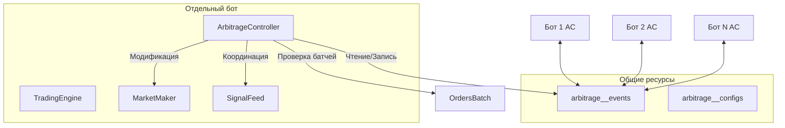

# ЛИКВИДНОСТНЫЙ АРБИТРАЖ — Техническое задание

**Версия:** 0.2-draft  
**Дата:** 2026-04-07  
**Статус:** Сбор требований

---

## 1. Общее описание

Межбиржевой арбитраж в рамках **распределения ликвидности** — механизм координации рабочих ботов из произвольного *арбитражного пула* через общую БД `arbitrage__events`, позволяющий:

1. **Набирать/разгружать требуемую позицию** с наиболее ликвидных бирж, откладывая сделки на неликвидных
2. **Согласовывать диспропорции объёмов** до начала исполнения
3. **Кросс-выравнивать позиции** малыми объёмами между ботами пула

---

## 2. Ключевые сущности

### 2.1 Арбитражный пул

Группа ботов (>=2), объединённых общей целью оптимизации исполнения через распределение ликвидности. Пулы конфигурируются в `arbitrage__configs`.

### 2.2 Участник пула

Отдельный бот, подключённый к пулу. Идентифицируется:
- `bot_id` — уникальный ID бота (host_id + account_id)
- `exchange` — биржа бота
- `liquidity_rank` — ранг ликвидности (1 = наиболее ликвидная)

---

## 3. Схема базы данных

### 3.1 `arbitrage__configs` — Конфигурация пулов

```sql
CREATE TABLE `arbitrage__configs` (
  `pool_id`       VARCHAR(32)  NOT NULL COMMENT 'UUID пула',
  `name`          VARCHAR(64)  NOT NULL COMMENT 'Человекочитаемое имя',
  `created_at`    TIMESTAMP(3) NOT NULL DEFAULT CURRENT_TIMESTAMP(3),
  `updated_at`    TIMESTAMP(3) NOT NULL DEFAULT CURRENT_TIMESTAMP(3) ON UPDATE CURRENT_TIMESTAMP(3),
  
  -- Участники пула
  `members`       JSON         NOT NULL COMMENT 'Массив объектов {bot_id, exchange, liquidity_rank}',
  
  -- Пороговые значения ликвидности (фиатный эквивалент)
  `max_disbalance_fiat`  DECIMAL(16,2) NOT NULL DEFAULT 1000.00 
    COMMENT 'Макс. допустимый дисбаланс до срабатывания выравнивания (USD)',
  `min_trade_fiat`       DECIMAL(16,2) NOT NULL DEFAULT 50.00 
    COMMENT 'Мин. размер сделки для инициации кросс-выравнивания (USD)',
  `max_trade_fiat`       DECIMAL(16,2) NOT NULL DEFAULT 500.00 
    COMMENT 'Макс. размер одной сделки кросс-выравнивания (USD)',
  
  -- Тайминги
  `coord_timeout_sec`    INT UNSIGNED NOT NULL DEFAULT 30 
    COMMENT 'Таймаут фазы координации объёмов',
  `rebalance_interval_sec` INT UNSIGNED NOT NULL DEFAULT 300 
    COMMENT 'Мин. интервал между событиями ребалансировки',
  
  -- Флаги
  `enabled`      TINYINT(1) NOT NULL DEFAULT 1,
  `auto_rank`    TINYINT(1) NOT NULL DEFAULT 1 
    COMMENT 'Автоматически рассчитывать ранги ликвидности по глубине рынка',
  
  PRIMARY KEY (`pool_id`),
  KEY `idx_enabled` (`enabled`),
  KEY `idx_name` (`name`)
) ENGINE=InnoDB DEFAULT CHARSET=utf8mb4 COLLATE=utf8mb4_general_ci;
```

#### Альтернативные варианты дизайна

| Вариант | Плюсы | Минусы |
|---------|-------|--------|
| **Нормализованный (описанный)** | Единая точка истины, простые JOIN | Больше запросов для сборки списка участников |
| **EAV-паттерн** | Гибкие настройки на участника | Сложные запросы, нет внешних ключей |
| **Отдельная таблица `arbitrage__members`** | Чёткое 1:N отношение | Дополнительная таблица и JOIN-накладные |

**Рекомендация:** Использовать JSON-колонку для `members` — список небольшой (<20) и редко запрашивается отдельно.

---

### 3.2 `arbitrage__events` — Журнал событий и координация

```sql
CREATE TABLE `arbitrage__events` (
  `id`            BIGINT UNSIGNED NOT NULL AUTO_INCREMENT,
  `pool_id`       VARCHAR(32)     NOT NULL,
  
  -- Временные метки
  `ts`            TIMESTAMP(3)    NOT NULL DEFAULT CURRENT_TIMESTAMP(3),
  `ts_expires`    TIMESTAMP(3)    NOT NULL,
  
  -- Участник
  `bot_id`        VARCHAR(64)     NOT NULL COMMENT 'host_id:account_id',
  `exchange`      VARCHAR(16)     NOT NULL,
  
  -- Контекст события
  `pair_id`       INT UNSIGNED    NOT NULL DEFAULT 0,
  `phase`         ENUM('ANNOUNCE','LIQUIDITY_QUERY','LIQUIDITY_REPLY',
                        'COORDINATE','EXECUTE','CONFIRM','CANCEL','TIMEOUT') NOT NULL,
  
  -- Данные объёма (со знаком: положительный = покупка/лонг, отрицательный = продажа/шорт)
  `volume_native` DECIMAL(20,8)   NOT NULL DEFAULT 0,
  `price_hint`    DECIMAL(16,8)   NOT NULL DEFAULT 0 COMMENT 'Ожидаемая цена для расчёта объёма',
  `volume_fiat`   DECIMAL(16,2)   GENERATED ALWAYS AS (
                      `volume_native` * `price_hint`) STORED,
  
  -- Поля агрегации
  `total_volume_fiat` DECIMAL(16,2) NOT NULL DEFAULT 0 
    COMMENT 'Накопительный итог после этого события',
  `disbalance_fiat`   DECIMAL(16,2) NOT NULL DEFAULT 0 
    COMMENT 'Дисбаланс после агрегации',
  
  -- Корреляция
  `correlation_id` VARCHAR(64)     DEFAULT NULL COMMENT 'Группирует связанные события',
  `parent_event_id` BIGINT UNSIGNED DEFAULT NULL,
  
  -- Статус
  `status`        ENUM('pending','confirmed','expired','cancelled') NOT NULL DEFAULT 'pending',
  `flags`         INT UNSIGNED     NOT NULL DEFAULT 0,
  
  PRIMARY KEY (`id`),
  KEY `idx_pool_phase` (`pool_id`, `phase`),
  KEY `idx_pool_status` (`pool_id`, `status`),
  KEY `idx_expires` (`ts_expires`),
  KEY `idx_correlation` (`correlation_id`),
  KEY `idx_pair` (`pair_id`)
) ENGINE=InnoDB DEFAULT CHARSET=utf8mb4 COLLATE=utf8mb4_general_ci;
```

---

## 4. Оценка ликвидности участников

### 4.1 Факторы оценки

Ликвидность каждого участника пула вычисляется как **взвешенная сумма факторов**:

```
LiquidityScore = w_volume * V_score + w_spread * S_score + w_funding * F_score
```

| Фактор | Обозначение | Описание | Вес (w) |
|--------|------------|---------|----------|
| Торговые объёмы | V | Объём за 24h / max_объём_в_пуле | 0.5 |
| Размер спреда | S | 1 - (spread / max_spread_in_pool) | 0.3 |
| Действующий фандинг | F | Нормализованный фандинг (0..1) | 0.2 |

**Нормализация:**
- V_score = volume_24h / max(volumes_in_pool) ∈ [0, 1]
- S_score = 1 - (spread / max_spread_in_pool) ∈ [0, 1]  (меньший спред = лучше)
- F_score = (funding - min_funding) / (max_funding - min_funding) ∈ [0, 1]

### 4.2 Блокировка ценопа-based перекосов

Долговременный перекос цен (ценовой чикл) **не является индикатором ликвидности** и должен блокироваться.

**Сигналы ценового перекоса:**
```php
class LiquidityAssessor {
    // Порог перекоса, при котором участник исключается из оценки ликвидности
    const PRICE_SKEW_THRESHOLD = 0.02;  // 2%
    
    // Минимальное время для подтверждения перекоса (защита от всплесков)
    const SKEW_CONFIRM_SECONDS = 300;    // 5 минут
    
    public function DetectPriceSkew(string $exchange_a, string $exchange_b): bool {
        $price_a = $this->GetAvgPrice($exchange_a);
        $price_b = $this->GetAvgPrice($exchange_b);
        
        $skew = abs($price_a - $price_b) / min($price_a, $price_b);
        
        if ($skew > self::PRICE_SKEW_THRESHOLD) {
            $this->skew_alerts[$exchange_a][$exchange_b] = [
                'detected_at' => time(),
                'skew_value' => $skew,
            ];
            return true;
        }
        
        return false;
    }
    
    public function IsPriceSkewConfirmed(string $exchange_a, string $exchange_b): bool {
        if (!isset($this->skew_alerts[$exchange_a][$exchange_b])) {
            return false;
        }
        
        $alert = $this->skew_alerts[$exchange_a][$exchange_b];
        $duration = time() - $alert['detected_at'];
        
        // Перекос должен держаться минимум SKEW_CONFIRM_SECONDS
        return $duration >= self::SKEW_CONFIRM_SECONDS;
    }
    
    public function IsWithdrawalProblem(string $exchange): bool {
        // Проверка индикаторов проблем с выводом:
        // - Аномально высокий фандинг
        // - Расширение спреда
        // - Снижение объёмов при сохранении позиций
        
        $funding = $this->GetFunding($exchange);
        $spread = $this->GetSpread($exchange);
        $volume_ratio = $this->GetVolumeRatio($exchange);
        
        return $funding > self::FUNDING_ANOMALY_THRESHOLD
            || $spread > self::SPREAD_ANOMALY_THRESHOLD * $this->GetAvgSpread()
            || $volume_ratio < 0.5;  // Объёмы упали вдвое
    }
}
```

**Механизм блокировки:**

```
ЕСЛИ IsPriceSkewConfirmed() == true:
    // Исключить участника из расчёта оптимального распределения
    // Заблокировать выделение объёма этому участнику
    // Отправить ALERT в журнал событий
    
ЕСЛИ IsWithdrawalProblem() == true:
    // Полная блокировка арбитражного участия
    // Уведомить координатора
    // Запустить механизм возврата уже выделенных объёмов
```

### 4.3 Получение данных для оценки

```php
interface LiquidityDataSource {
    // Данные order book
    public function GetOrderBook(string $exchange, int $pair_id): array;
    
    // 24h торговые объёмы
    public function Get24hVolume(string $exchange, int $pair_id): float;
    
    // Текущий спред
    public function GetSpread(string $exchange, int $pair_id): float;
    
    // Фандинг ставка
    public function GetFundingRate(string $exchange, int $pair_id): float;
}

class BinanceLiquiditySource implements LiquidityDataSource {
    public function GetOrderBook(string $exchange, int $pair_id): array {
        // REST API: GET /api/v3/depth
        // Возвращает массив bids/asks с объёмами
    }
    
    public function GetSpread(string $exchange, int $pair_id): float {
        $ob = $this->GetOrderBook($exchange, $pair_id);
        if (empty($ob['bids']) || empty($ob['asks'])) return 0;
        
        $best_bid = $ob['bids'][0][0];
        $best_ask = $ob['asks'][0][0];
        
        return ($best_ask - $best_bid) / (($best_ask + $best_bid) / 2);
    }
    
    public function Get24hVolume(string $exchange, int $pair_id): float {
        // REST API: GET /api/v3/ticker/24hr
    }
    
    public function GetFundingRate(string $exchange, int $pair_id): float {
        // REST API: GET /fapi/v1/fundingRate
    }
}
```

### 4.4 Order Book как источник оценки

```php
class OrderBookLiquidityCalculator {
    // Глубина order book для расчёта (уровни от лучшей цены)
    const BOOK_LEVELS = 10;
    
    // Лимит накопленного объёма (отсечение "хвоста" книги)
    const MAX_CUMULATIVE_VOLUME = 1.0;  // BTC или эквивалент
    
    public function CalculateAvailableLiquidity(
        array $order_book, 
        float $price, 
        float $target_volume
    ): LiquidityEstimate {
        
        $side = $target_volume >= 0 ? 'asks' : 'bids';
        $cumulative = 0;
        $weighted_price = 0;
        $levels_used = 0;
        
        foreach ($order_book[$side] as $level) {
            [$level_price, $level_volume] = $level;
            
            // Игнорируем уровни слишком далеко от целевой цены
            $price_deviation = abs($level_price - $price) / $price;
            if ($price_deviation > 0.01) break;  // >1% от цены
            
            $cumulative += $level_volume;
            $weighted_price += $level_price * $level_volume;
            $levels_used++;
            
            if ($cumulative >= self::MAX_CUMULATIVE_VOLUME) break;
        }
        
        return new LiquidityEstimate(
            volume: $cumulative,
            avg_price: $cumulative > 0 ? $weighted_price / $cumulative : $price,
            levels: $levels_used,
            market_impact: $this->EstimateMarketImpact($cumulative, $order_book[$side])
        );
    }
    
    // Оценка влияния на рынок (проскальзывание)
    private function EstimateMarketImpact(array $orders): float {
        // Простая модель: проскальзывание ~ sqrt(объём / глубина)
        $depth = array_sum(array_column($orders, 1));
        $volume = array_sum(array_column($orders, 1));  // Для упрощения
        
        return $volume > 0 ? sqrt($volume / max($depth, 0.001)) : 0;
    }
}
```

### 4.5 Взаимодействие с ArbitrageController

```php
class ArbitrageController {
    protected $liquidity_assessor;
    
    public function EvaluatePoolMembers(): array {
        $scores = [];
        
        foreach ($this->config['members'] as $member) {
            $exchange = $member['exchange'];
            $pair_id = $this->current_pair_id;
            
            // Проверка блокировок
            if ($this->IsMemberBlocked($member['bot_id'])) {
                $scores[$member['bot_id']] = 0;
                continue;
            }
            
            // Проверка ценоперекоса
            if ($this->liquidity_assessor->IsPriceSkewConfirmed($exchange, $this->reference_exchange)) {
                $this->LogMsg("~C91#ARB_BLOCK:~C00 $exchange blocked due to price skew");
                $scores[$member['bot_id']] = 0;
                continue;
            }
            
            // Расчёт ликвидности
            $score = $this->liquidity_assessor->CalculateScore($exchange, $pair_id);
            $scores[$member['bot_id']] = $score;
        }
        
        return $scores;
    }
    
    public function AllocateVolume(float $total_volume): array {
        $scores = $this->EvaluatePoolMembers();
        $total_score = array_sum($scores);
        
        if ($total_score == 0) {
            // Все участники заблокированы — арбитраж невозможен
            return [];
        }
        
        $allocations = [];
        $remaining = $total_volume;
        
        // Сортировка по убыванию ликвидности
        arsort($scores);
        
        foreach ($scores as $bot_id => $score) {
            if ($score == 0) continue;
            
            $share = $score / $total_score;
            $allocation = $remaining * $share;
            
            // Проверка максимального размера сделки
            $max_trade = $this->config['max_trade_fiat'] / $this->current_price;
            $allocation = min($allocation, $max_trade);
            
            $allocations[$bot_id] = $allocation;
            $remaining -= $allocation;
            
            if ($remaining <= 0) break;
        }
        
        return $allocations;
    }
}
```

---

## 5. Протокол событий

### 5.1 Диаграмма состояний фаз

```
┌─────────────┐     ┌─────────────────────┐     ┌─────────────┐
│  ANNOUNCE   │────►│ LIQUIDITY_QUERY     │────►│LIQUIDITY_   │
│ (анонс)     │     │ (объявление объёма)  │     │  REPLY      │
└─────────────┘     └─────────────────────┘     │ (ответ)     │
                                                   └─────────────┘
                                                           │
                                                           ▼
┌─────────────┐     ┌─────────────────────┐     ┌─────────────┐
│   CANCEL    │◄────│     COORDINATE       │◄────│   EXECUTE   │
│ (отмена)    │     │ (устранение дисбаланса│     │ (сделка)    │
└─────────────┘     └─────────────────────┘     └─────────────┘
        │                                           │
        │              ┌─────────────┐              │
        └─────────────►│   TIMEOUT   │◄────────────┘
                       │ (истекло)   │
                       └─────────────┘
```

### 4.2 Нормальный торговый цикл — основа для арбитражного распределения

Прежде чем описывать протокол координации, необходимо понять, как формируется объём для распределения в нормальном торговом цикле.

#### 4.2.1 Стадии обычного исполнения

```
┌──────────────────────────────────────────────────────────────────────────────┐
│                     НОРМАЛЬНЫЙ ТОРГОВЫЙ ЦИКЛ                                │
└──────────────────────────────────────────────────────────────────────────────┘

  ┌─────────────┐
  │   СИГНАЛЫ   │  Внешние сигналы (ExternalSignal) или сумма сигналов
  └──────┬──────┘
         │ delta = TargetDeltaPos() - CurrentDeltaPos()
         ▼
  ┌─────────────┐
  │ ДЕТАЛЬТА    │  Общий требуемый объём (со знаком)
  │ ПОЗИЦИИ     │
  └──────┬──────┘
         │
         │ + offset смещения (если настроено)
         ▼
  ┌─────────────────────────┐
  │  ГОЛОВНОЙ ОБЪЁМ        │  Полный объём для размещения
  │  (head_volume)         │  
  └────────────┬────────────┘
               │
               │ MM начинает заполнять батчи заявками
               ▼
  ┌─────────────────────────┐
  │  ЗАПОЛНЕНИЕ БАТЧЕЙ     │  MarketMaker (полуавтономный механизм)
  │  ЗАЯВКАМИ             │  - Размещает заявки порциями
  │                       │  - Отслеживает исполнение
  └────────────┬───────────┘
               │
               │ ЦИКЛ ИСПОЛНЕНИЯ
               ▼
  ┌─────────────────────────┐
  │  ОСТАТОК ОБЪЁМА        │  = head_volume - matched_volume
  │  (tail_volume)          │  ИМЕННО ЗДЕСЬ подключается
  └────────────┬───────────┘    арбитражное распределение
               │
               ▼
  ┌─────────────────────────────────────────────────────┐
  │  ПРЕДЛОЖЕНИЕ ОСТАТКА В АРБИТРАЖНЫЙ ПУЛ             │
  │  arbitrage__events: LIQUIDITY_QUERY                 │
  └─────────────────────────────────────────────────────┘
```

#### 4.2.2 Интеграция с MarketMaker

Маркет-мейкер (`MarketMaker`) работает как **полуавтономный механизм заполнения батчей заявками**. Это создаёт следующую задачу интеграции:

**Проблема:**
- ММ начинает выставлять заявки для набора позиции
- В это время происходит арбитражное согласование
- Если согласование задерживается или отменяется, ММ уже имеет активные заявки

**Решение: Отложенное согласование с флагом готовности**

```php
class OrdersBatch {
    // Новые поля для арбитражной координации
    public $arbitrage_pending = false;   // Ожидает согласования арбитража
    public $arbitrage_pool_id = null;     // ID пула, которому предложен объём
    public $arbitrage_correlation = null; // correlation_id для отслеживания
    
    // Флаг BATCH_MM уже существует, используем для идентификации
}

// В MarketMaker:
class MarketMaker {
    // При создании батча — пометить как ожидающий согласования
    public function AddBatch(OrdersBatch $batch, ...) {
        // ... существующая логика ...
        
        if ($batch->arbitrage_pending) {
            // НЕ выставлять заявки, пока не придёт подтверждение
            $this->LogMsg("~C93#ARB_WAIT:~C00 Batch %d waiting for arbitrage coordination", $batch->id);
            return;
        }
        
        // Обычная работа
        $this->OpenOrders($this->exec, $this->max_orders - $this->exec->Count());
    }
    
    // Метод отмены при таймауте арбитража
    public function OnArbitrageTimeout(string $correlation_id): void {
        foreach ($this->batches as $batch) {
            if ($batch->arbitrage_correlation === $correlation_id) {
                $batch->arbitrage_pending = false;
                $batch->arbitrage_pool_id = null;
                $batch->arbitrage_correlation = null;
                
                // Возобновить обычную работу
                $this->OpenOrders($this->exec, $this->max_orders - $this->exec->Count());
                
                $this->LogMsg("~C92#ARB_TIMEOUT:~C00 Batch %d released for normal execution", $batch->id);
            }
        }
    }
    
    // Метод подтверждения — разрешить исполнение
    public function OnArbitrageConfirmed(string $correlation_id, float $allocated_volume): void {
        foreach ($this->batches as $batch) {
            if ($batch->arbitrage_correlation === $correlation_id) {
                $batch->arbitrage_pending = false;
                
                // Корректируем целевой объём
                $batch->target_pos = $allocated_volume;
                $batch->Save();
                
                $this->OpenOrders($this->exec, $this->max_orders - $this->exec->Count());
                
                $this->LogMsg("~C92#ARB_CONFIRMED:~C00 Batch %d confirmed with volume %s", 
                    $batch->id, $this->tinfo->FormatAmount($allocated_volume));
            }
        }
    }
}
```

### 5.3 Протокол координации (3-фазный)

**Важно:** Все операции распределения выполняются только после проверки ликвидности и блокировки ценоперекосов (секция 4).

#### Фаза 1: ANNOUNCE + LIQUIDITY_QUERY

Каждый бот, планирующий сделку, **объявляет** её в пуле:

```sql
INSERT INTO arbitrage__events 
  (pool_id, ts_expires, bot_id, exchange, pair_id, phase, volume_native, price_hint, correlation_id, flags)
VALUES 
  ('pool-uuid-1', NOW() + INTERVAL 30 SECOND, 'host1:acc1', 'binance', 1, 'ANNOUNCE', 0.5, 95000, 'corr-123', 0);
```

Одновременно публикуется событие `LIQUIDITY_QUERY`:

```sql
INSERT INTO arbitrage__events 
  (pool_id, ts_expires, bot_id, exchange, phase, volume_native, price_hint, correlation_id, flags)
VALUES 
  ('pool-uuid-1', NOW() + INTERVAL 30 SECOND, 'host1:acc1', 'binance', 'LIQUIDITY_QUERY', 0, 0, 'corr-123', 
   AF_LIQUIDITY_WANTED);  -- флаг: запрашивает доступную ликвидность
```

#### Фаза 2: LIQUIDITY_REPLY

Боты-участники **отвечают** объёмом доступной ликвидности:

```sql
INSERT INTO arbitrage__events 
  (pool_id, ts_expires, bot_id, exchange, pair_id, phase, volume_native, price_hint, 
   total_volume_fiat, disbalance_fiat, correlation_id, parent_event_id)
VALUES 
  ('pool-uuid-1', NOW() + INTERVAL 30 SECOND, 'host2:acc1', 'bybit', 1, 'LIQUIDITY_REPLY', 
   -0.3, 95100,  -- Может поглотить 0.3 BTC продажу
   28500, -500,  -- Fiat-итого, дисбаланс vs требуемого
   'corr-123', (SELECT id FROM arbitrage__events WHERE correlation_id='corr-123' AND phase='LIQUIDITY_QUERY' LIMIT 1));
```

#### Фаза 3: COORDINATE → EXECUTE

После сбора ликвидности **координатор** (бот с liquidity_rank=1) вычисляет оптимальное распределение:

```
ЕСЛИ SUM(volume_fiat) >= required И disbalance_fiat <= max_disbalance_fiat:
    ОПОВЕСТИТЬ COORDINATE с финальным распределением
    ОЖИДАТЬ CONFIRM от всех участников
    ИСПОЛНИТЬ сделки
ИНАЧЕ:
    ОТМЕНА с причиной
```

### 5.4 Флаги событий

```php
define('AF_LIQUIDITY_WANTED',   0x001);  // Бот хочет поглотить ликвидность
define('AF_LIQUIDITY_OFFERING', 0x002);  // Бот предлагает доступную ликвидность
define('AF_COORDINATOR',        0x010);  // Этот бот — координатор
define('AF_TRADE_OWN',          0x020);  // Событие владеет исполнением сделки
define('AF_TRADE_DELEGATED',    0x040);  // Сделка делегирована другому боту
define('AF_POSITION_HOLD',       0x100);  // Бот удерживает позицию после сделки
define('AF_MM_HOLD',            0x200);  // MM приостановлен, ожидает согласования
define('AF_SKEW_BLOCKED',       0x400);  // Участник заблокирован из-за ценоперекоса
define('AF_WITHDRAWAL_BLOCKED', 0x800);  // Участник заблокирован из-за проблем вывода
```

---

## 6. Варианты реализации

### 6.1 Вариант А: На основе сигналов (Рекомендуемый)

**Основная идея:** Арбитражные события модифицируют существующие **смещающие сигналы** (bias signals), добавляя арбитражную компоненту смещения. Никаких дополнительных диапазонов ID не вводится.

#### 6.1.1 Существующая архитектура смещающих сигналов

В текущей системе уже существуют смещающие сигналы:
- Определены константой `MAX_OFFSET_SIG = 222`
- Имеют `id == pair_id` (1..222)
- Загружаются из таблицы `offset_pos` в `SignalFeed::Update()`
- **Пропускаются при загрузке из внешнего фида** (строка 2284: `if ($sig_id < MAX_OFFSET_SIG) continue;`)

```php
// SignalFeed::Update() — создание смещающих сигналов из offset_pos
public function Update() {
    foreach ($core->offset_pos as $pair_id => $offset) {
        if ($pair_id > 0 && $pair_id < MAX_OFFSET_SIG) {
            $sig = $this->GetSignal($pair_id, 0, true);
            $sig->pair_id = $pair_id;
            $sig->id = $pair_id;
            // ... инициализация из offset
        }
    }
}
```

#### 6.1.2 Две компоненты смещения внутри одного сигнала

Расширяем существующий смещающий сигнал двумя компонентами:

```
total_offset = base_offset + arbitrage_offset
```

| Компонента | Источник | Сброс |
|------------|---------|-------|
| **base_offset** | Таблица `offset_pos` (административное) | Вручную администратором |
| **arbitrage_offset** | `arbitrage__events` (арбитражное) | Автоматически после завершения арбитража |

```php
// Простой класс оффсетного сигнала — без математики внешних сигналов
class OffsetSignal extends ExternalSignal {
    // Две компоненты смещения
    public float $base_offset = 0;       // Административное (из offset_pos)
    public float $arbitrage_offset = 0;  // Арбитражное (из arbitrage__events)
    
    // Флаг ожидания согласования арбитража
    public bool $arbitrage_pending = false;
    public string $arbitrage_correlation = '';
    
    // Целевая позиция = сумма компонент (БЕЗ коэффициентов)
    public function TargetDeltaPos(bool $native = true): float {
        $total = $this->base_offset + $this->arbitrage_offset;
        // $this->LocalAmount() с raw=true, coef=false
        $amount = $this->mult;  // базовое количество без расчётов
        return $amount * $total;
    }
    
    // CurrentDeltaPos также возвращает сумму компонент
    public function CurrentDeltaPos(bool $native = true): float {
        return $this->TargetDeltaPos($native);  // для оффсета = same
    }
    
    // Очистка арбитражной компоненты
    public function ClearArbitrageOffset(): void {
        $this->arbitrage_offset = 0;
        $this->arbitrage_pending = false;
        $this->arbitrage_correlation = '';
    }
}
```

#### 6.1.3 Жизненный цикл

```
┌─────────────────────────────────────────────────────────────────────────────┐
│                      ЖИЗНЕННЫЙ ЦИКЛ ОФФСЕТНОГО СИГНАЛА                    │
└─────────────────────────────────────────────────────────────────────────────┘

  1. ЗАГРУЗКА                    2. ОБНОВЛЕНИЕ                   3. АРБИТРАЖ
  ┌──────────────────┐           ┌──────────────────┐           ┌──────────────────┐
  │ SignalFeed::      │           │ Update():        │           │ Arbitrage        │
  │ Update()          │           │                  │           │ Controller:      │
  │                  │           │ base_offset =    │           │                  │
  │ base_offset =     │──────────►│   offset_pos     │           │ arbitrage_offset │
  │   offset_pos      │           │ [+ arbitrage_    │◄──────────│   = allocated     │
  │                  │           │   offset]         │           │                  │
  └──────────────────┘           └──────────────────┘           └──────────────────┘
                                                                          │
                                                                          ▼
                                                    ┌──────────────────────────────────┐
                                                    │ 4. ОЧИСТКА (при таймауте/отмене) │
                                                    │                                  │
                                                    │ ClearArbitrageOffset()           │
                                                    │ base_offset остаётся              │
                                                    └──────────────────────────────────┘
```

#### 6.1.4 Управление арбитражным смещением

```php
class ArbitrageController {
    // Установить арбитражное смещение для пары
    public function SetArbitrageOffset(int $pair_id, float $volume): void {
        $sig = $this->signal_feed->GetSignal($pair_id);
        if (!$sig) {
            $this->LogError("~C91#ARB:~C00 No offset signal for pair %d", $pair_id);
            return;
        }
        
        $sig->arbitrage_offset = $volume;
        $sig->arbitrage_pending = true;
        $sig->arbitrage_correlation = $this->correlation_id;
        
        $this->LogMsg("~C92#ARB_SET:~C00 Pair %d arbitrage_offset = %s, pending",
            $pair_id, $sig->ticker_info->FormatAmount($volume));
    }
    
    // Подтверждение арбитража
    public function ConfirmArbitrage(string $correlation_id): void {
        $sig = $this->FindByCorrelation($correlation_id);
        if ($sig) {
            $sig->arbitrage_pending = false;
            $this->LogMsg("~C92#ARB_CONF:~C00 Pair %d arbitrage confirmed", $sig->pair_id);
        }
    }
    
    // Таймаут/отмена арбитража
    public function CancelArbitrage(string $correlation_id): void {
        $sig = $this->FindByCorrelation($correlation_id);
        if ($sig) {
            $sig->ClearArbitrageOffset();
            $this->LogMsg("~C93#ARB_CANCEL:~C00 Pair %d arbitrage cancelled", $sig->pair_id);
        }
    }
    
    // Поиск сигнала по correlation_id
    protected function FindByCorrelation(string $correlation_id): ?OffsetSignal {
        foreach ($this->signal_feed as $sig) {
            if ($sig instanceof OffsetSignal && $sig->arbitrage_correlation === $correlation_id) {
                return $sig;
            }
        }
        return null;
    }
}
```

#### 6.1.5 Интеграция с MarketMaker

```php
class MarketMaker {
    // При обработке батча — проверка статуса арбитража
    public function AddBatch(OrdersBatch $batch, ...) {
        $pair_id = $batch->pair_id;
        $sig = $this->signal_feed->GetSignal($pair_id);
        
        if ($sig instanceof OffsetSignal && $sig->arbitrage_pending) {
            // ММ приостановлен — ожидает согласования
            $this->LogMsg("~C93#ARB_WAIT:~C00 Batch %d waiting for arbitrage correlation=%s",
                $batch->id, $sig->arbitrage_correlation);
            return;
        }
        
        // Обычная работа ММ...
    }
}
```

#### 6.1.6 Преимущества подхода

- **Один id == pair_id** — никаких проблем с диапазонами и миграциями
- **Две компоненты в одном сигнале** — легко сальдируются
- **Независимый сброс** — арбитражное смещение сбрасывается без влияния на базовое
- **Простой класс `OffsetSignal`** — без математики `LocalAmount()`, коэффициентов и прочего
- **Блокировка параллельного арбитража** — проверка `arbitrage_pending` на той же паре

---

### 6.2 Вариант Б: Позиционное смещение (без сигналов)

**Основная идея:** Позиционные смещения хранятся отдельно и применяются к целевой позиции.

```php
class ArbitrageOffset {
    public string   $pool_id;
    public int      $pair_id;
    public string   $bot_id;
    public float    $offset_native;   // Положительное = дополнительный лонг, отрицательное = дополнительный шорт
    public float    $applied_at;      // Временная метка применения
    public string   $correlation_id;
    
    // Применить к целевой позиции
    public function ApplyToTarget(float $target): float {
        return $target + $this->offset_native;
    }
    
    // Проверка необходимости отката
    public function ShouldRevoke(): bool {
        // Логика определения, когда смещение должно быть отозвано
    }
}
```

**Плюсы:**
- Нет конфликтов ID сигналов
- Чёткое разделение ответственности

**Минусы:**
- Сложная логика отката при изменении позиций
- Необходимость отдельного отслеживания жизненного цикла смещений
- Сложнее коррелировать с реальными сделками

---

## 7. Интеграция ArbitrageController

### 7.1 Архитектура



### 7.2 Класс ArbitrageController

```php
class ArbitrageController {
    public string   $pool_id;
    public string   $bot_id;
    public int      $liquidity_rank;
    protected $core;        // TradingCore
    protected $engine;       // TradingEngine
    protected $config;      // Конфигурация пула
    
    // Обработчики фаз
    public function OnAnnounce(ArbitrageEvent $event): void { ... }
    public function OnLiquidityQuery(ArbitrageEvent $event): void { ... }
    public function OnLiquidityReply(ArbitrageEvent $event): void { ... }
    public function OnCoordinate(ArbitrageEvent $event): void { ... }
    public function OnExecute(ArbitrageEvent $event): void { ... }
    public function OnConfirm(ArbitrageEvent $event): void { ... }
    public function OnCancel(ArbitrageEvent $event): void { ... }
    public function OnTimeout(ArbitrageEvent $event): void { ... }
    
    // Жизненный цикл
    public function ProcessPoolEvents(): void { ... }   // Интеграция в основной цикл
    public function CleanupExpiredEvents(): void { ... }
    public function GetPoolDisbalance(): float { ... }
    
    // Сканирование кросс-выравнивания
    public function ScanCrossAlignment(): array { ... }
    
    // Интеграция с MM
    public function ProposeToPool(float $tail_volume, int $pair_id, OrdersBatch $batch): ?string {
        // Предложить остаток объёма в пул
        // Пометить батч как arbitrage_pending
        // Вернуть correlation_id для отслеживания
    }
    
    public function OnArbitrageConfirmed(string $correlation_id, float $volume): void {
        // Уведомить MM о подтверждении
        // $this->engine->MarketMaker($pair_id)->OnArbitrageConfirmed(...)
    }
    
    public function OnArbitrageTimeout(string $correlation_id): void {
        // Уведомить MM о таймауте
        // $this->engine->MarketMaker($pair_id)->OnArbitrageTimeout(...)
    }
}
```

### 7.3 Точка интеграции в торговый цикл

```php
// В TradingCore::Update() или TradingLoop
class TradingLoop {
    public function ProcessArbitrage() {
        $ac = $this->arbitrage_controller;
        if (!$ac) return;
        
        // Обработать входящие события пула
        $ac->ProcessPoolEvents();
        
        // Для активных батчей — проверить остатки для арбитража
        foreach ($this->engine->batches as $batch) {
            if ($batch->IsActive() && !$batch->arbitrage_pending) {
                $tail = $batch->TargetLeft();
                $tail_cost = $this->engine->TickerInfo($batch->pair_id)->last_price * abs($tail);
                
                // Если остаток значительный — предложить пулу
                if ($tail_cost >= $ac->config['min_trade_fiat']) {
                    $ac->ProposeToPool($tail, $batch->pair_id, $batch);
                }
            }
        }
    }
}
```

---

## 8. Кросс-выравнивание (Фаза 4)

После согласования основного объёма боты непрерывно сканируют **небольшие возможности кросс-выравнивания**:

```php
public function ScanCrossAlignment(): array {
    $opportunities = [];
    
    // Получить текущий дисбаланс пула
    $disbalance = $this->GetPoolDisbalance();
    
    if (abs($disbalance) < $this->config['min_trade_fiat']) {
        return $opportunities;  // Ниже порога
    }
    
    // Найти контр-сторонних ботов
    $counterparties = $this->FindCounterparties($disbalance > 0);
    
    foreach ($counterparties as $cp) {
        $amount = min(
            abs($disbalance),
            $cp['available_liquidity_fiat'],
            $this->config['max_trade_fiat']
        );
        
        if ($amount >= $this->config['min_trade_fiat']) {
            $opportunities[] = [
                'target_bot'       => $cp['bot_id'],
                'volume_native'    => $amount / $cp['price'],
                'price'            => $cp['price'],
                'correlation_id'   => $this->NewCorrelationId(),
            ];
        }
    }
    
    return $opportunities;
}
```

---

## 9. Истечение событий и очистка

```sql
-- Очистка истёкших событий (запускать периодически)
DELETE FROM arbitrage__events 
WHERE status = 'pending' 
  AND ts_expires < NOW() 
  AND ts_expires > NOW() - INTERVAL 1 HOUR;

-- Перемещение в архив
INSERT INTO arbitrage__events_archive 
SELECT *, NOW() FROM arbitrage__events 
WHERE ts_expires < NOW() - INTERVAL 1 HOUR;

DELETE FROM arbitrage__events 
WHERE ts_expires < NOW() - INTERVAL 1 HOUR;
```

---

## 10. Стратегия генерации идентификаторов

### Для `arbitrage__configs.pool_id`

```php
function GeneratePoolId(): string {
    return sprintf('%04x%04x-%04x-%04x-%04x-%06x%04x',
        mt_rand(0, 0xFFFF), mt_rand(0, 0xFFFF),
        mt_rand(0, 0xFFFF),
        mt_rand(0, 0x0FFF) | 0x4000,  // Версия 4 (UUID)
        mt_rand(0, 0x3FFF) | 0x8000,  // Variant
        mt_rand(0, 0xFFFFFF),
        mt_rand(0, 0xFFFF)
    );
}
```

### Для `arbitrage__events.correlation_id`

```php
function NewCorrelationId(): string {
    return sprintf('arb-%s-%d-%04x',
        $this->pool_id,
        time(),
        mt_rand(0, 0xFFFF)
    );
}
```

---

## 11. Открытые вопросы

1. **Выбор координатора:** Должна ли роль координатора ротироваться или всегда принадлежать боту с highest liquidity_rank?

2. **Частичное исполнение:** Как обрабатывать ситуации, когда исполнена только часть объявленного объёма?

3. **Разделение сети:** Что произойдёт, если бот выйдет из сети во время фазы COORDINATE?

4. **Мульти-ножечный арбитраж:** Должна ли система поддерживать арбитражные пути с более чем 2 участниками?

5. **Допуск проскальзывания:** Как распространять допуск цены через протокол координации?

6. **Таймаут MM:** Как долго MM должен ждать согласования перед возобновлением обычной работы?

7. **Приоритеты:** Что делать, если сигнал требует срочного исполнения, а арбитражное согласование занято?

8. **Веса факторов:** Какие значения весов (0.5, 0.3, 0.2) оптимальны для разных рынков?

9. **Пороги блокировки:** Как определить оптимальные значения PRICE_SKEW_THRESHOLD и SKEW_CONFIRM_SECONDS?

10. **Источник спреда:** Какую цену использовать как референсную для расчёта спреда (mid, last, vwap)?

11. **Сброс арбитражного offset:** Как определять, когда арбитражное смещение должно быть сброшено (таймаут vs успешное исполнение)?

12. **Наследование или новый класс:** `OffsetSignal` должен наследовать `ExternalSignal` или быть полностью независимым?

---

## 12. Файлы для создания/изменения

| Файл | Действие |
|------|----------|
| `src/liquidity_assessor.php` | НОВЫЙ — Оценка ликвидности участников пула |
| `src/liquidity_datasource.php` | НОВЫЙ — Интерфейс и реализации для разных бирж |
| `src/orderbook_calculator.php` | НОВЫЙ — Расчёт по order book |
| `src/arbitrage_controller.php` | НОВЫЙ — Основной класс контроллера |
| `src/arbitrage_event.php` | НОВЫЙ — Класс записи события |
| `src/arbitrage_config.php` | НОВЫЙ — Загрузчик конфигурации |
| `src/offset_signal.php` | НОВЫЙ — Простой класс OffsetSignal без математики |
| `src/ext_signals.php` | ИЗМЕНЕНИЕ — Поддержка `arbitrage_offset` в смещающих сигналах |
| `src/signal_feed.php` | ИЗМЕНЕНИЕ — Интеграция OffsetSignal |
| `templates/arbitrage_configs.sql` | НОВЫЙ — DDL таблицы конфигов |
| `templates/arbitrage_events.sql` | НОВЫЙ — DDL таблицы событий |
| `src/trading_core.php` | ИЗМЕНЕНИЕ — Создание экземпляра ArbitrageController |
| `src/trading_loop.php` | ИЗМЕНЕНИЕ — Добавить вызов ProcessPoolEvents() |
| `src/market_maker.php` | ИЗМЕНЕНИЕ — Добавить методы арбитражного контроля |
| `src/orders_batch.php` | ИЗМЕНЕНИЕ — Добавить поля arbitrage_pending |
| `docker/mariadb-init/*.sql` | ИЗМЕНЕНИЕ — Включить новые таблицы |

---

## 13. План работ

- [ ] Уточнить схему таблиц
- [ ] Спроектировать интерфейс LiquidityDataSource для всех бирж
- [ ] Реализовать LiquidityAssessor с блокировкой ценоперекосов
- [ ] Реализовать OrderBookLiquidityCalculator
- [ ] Создать класс OffsetSignal (простой, без математики ExternalSignal)
- [ ] Расширить существующие смещающие сигналы для поддержки `arbitrage_offset`
- [ ] Реализовать скелет ArbitrageController с методами Set/ClearArbitrageOffset()
- [ ] Добавить проверку `arbitrage_pending` в MarketMaker::AddBatch()
- [ ] Определить точку запуска бота для интеграции
- [ ] Спроектировать Web UI для управления пулами
- [ ] Написать тесты протокола координации
- [ ] Документировать сценарии отказоустойчивости
- [ ] Калибровать веса факторов ликвидности на исторических данных
