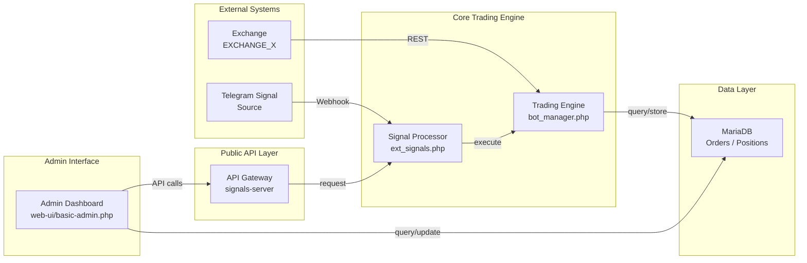
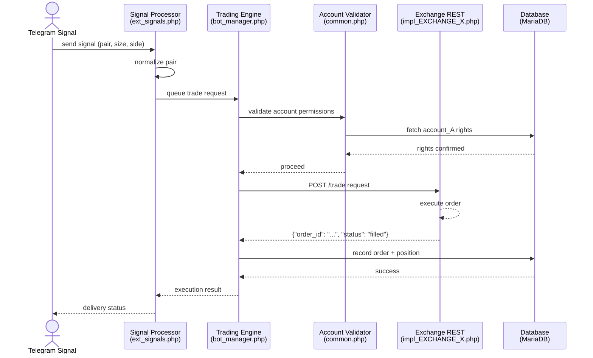
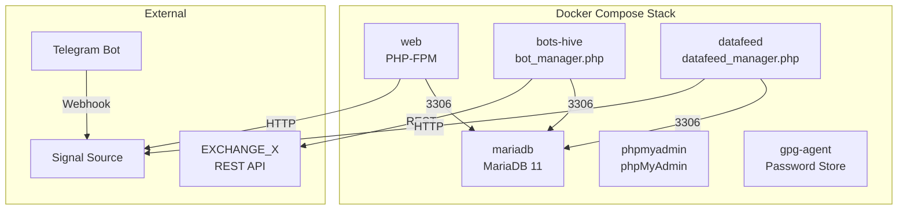
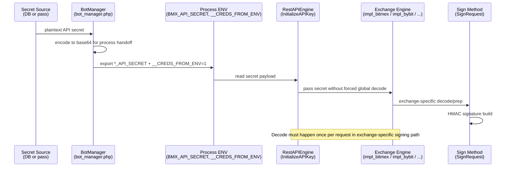

# Architecture Diagrams

## Overview
Key system components and data flows rendered as Mermaid diagrams for clarity.

---

## Diagram 1: Component Map

**Legend:**
- `EXCHANGE_X` = Live trading exchange (Binance/Bitfinex/BitMEX/Deribit/Bybit).
- `signals-server` = Public API endpoint for internal tools and integrations.
- `bot_manager.php` = Central orchestrator for trade execution and position monitoring.
- `ext_signals.php` = External signal intake and normalization.
- `web-ui/basic-admin.php` = Admin trading dashboard and controls.

---

## Diagram 2: Trade Execution Flow

**Steps:**
1. External signal arrives via Telegram webhook.
2. Signal processor normalizes asset pair.
3. Trade engine validates caller account permissions.
4. Permission check fetches account rights from database.
5. If approved, exchange REST adapter executes trade.
6. Order and position recorded in database.
7. Confirmation visible in admin dashboard.

---

## Diagram 3: Deployment Architecture (Docker)

**Notes:**
- Compose runtime uses one MariaDB service (replication depends on external setup).
- bots-hive runs bot_manager.php for trade execution.
- datafeed runs datafeed_manager.php for market data ingestion.
- web serves PHP admin interface.
- gpg-agent can be used for encrypted secret storage where configured.
- phpmyadmin for database administration.

---

## Diagram 4: API Secret Delivery Pipeline

**Operational invariants:**
- No universal forced decode in `InitializeAPIKey` for all exchanges.
- Decode is owned by exchange-specific signing flow (`SignRequest` or equivalent).
- Any change in secret transport format requires smoke checks for at least BitMEX and Bybit.
