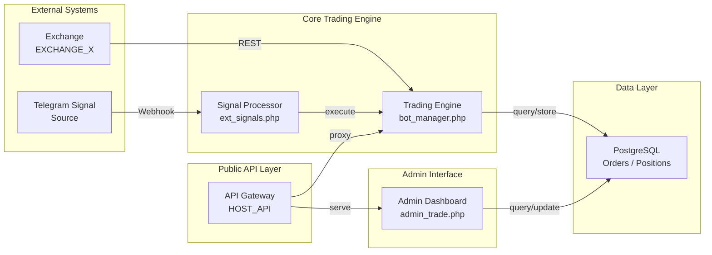
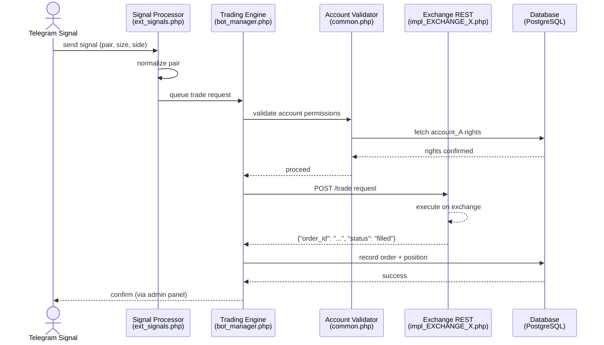
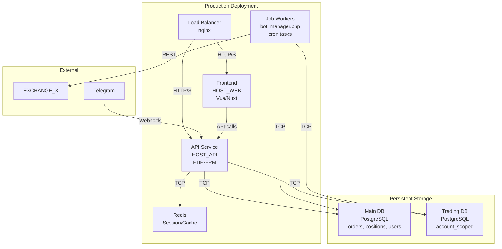

# Architecture Diagrams

## Overview
Key system components and data flows rendered as Mermaid diagrams for clarity.

---

## Diagram 1: Component Map

**Legend:**
- `EXCHANGE_X` = Live trading exchange (Binance/Bitfinex/etc).
- `HOST_API` = Public API endpoint for internal tools and integrations.
- `bot_manager.php` = Central orchestrator for trade execution and position monitoring.
- `ext_signals.php` = External signal intake and normalization.
- `admin_trade.php` = Admin trading dashboard and controls.

---

## Diagram 2: Trade Execution Flow

**Steps:**
1. External signal arrives via Telegram webhook.
2. Signal processor normalizes asset pair.
3. Trade engine validates caller account permissions.
4. Permission check fetches account rights from database.
5. If approved, exchange REST adapter executes trade.
6. Order and position recorded in database.
7. Confirmation visible in admin dashboard.

---

## Diagram 3: Deployment Architecture (Sanitized)

**Notes:**
- Frontend and API share load balancer.
- Main database hosts core trading state (orders, positions, users).
- Separate trading database for account-scoped operations.
- Redis for session and cache layer.
- Job workers (bot_manager.php via cron) execute scheduled tasks and rebalancing.
- Both databases replicated for DR (not shown).
