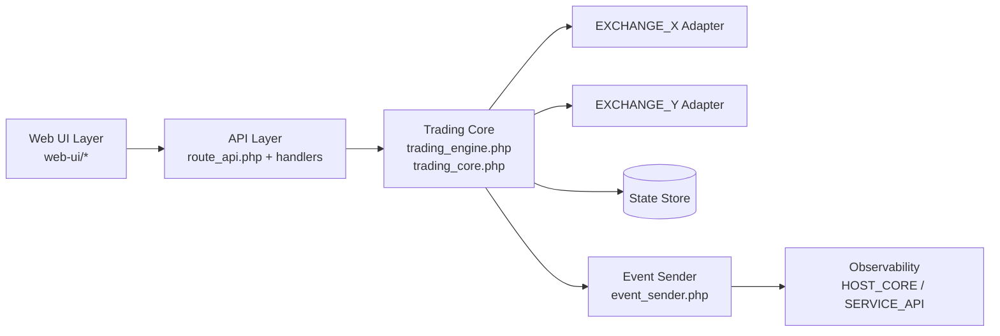
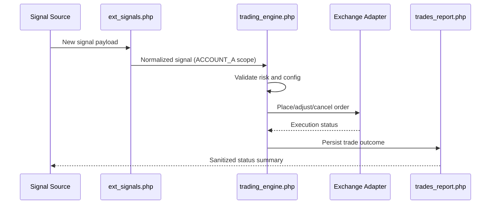
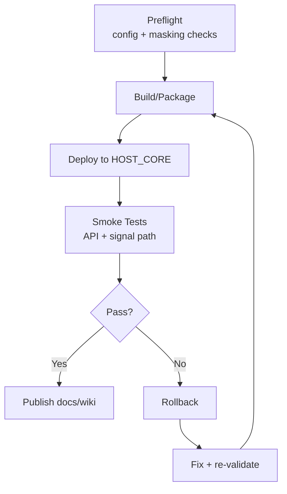

# Architecture Diagrams (Sanitized)

## 1. High-Level Subcomponent Structure

## 2. Trading Signal Data Flow

## 3. Deployment and Validation Cycle

## Notes
- Use placeholders in all shared diagrams and docs.
- Keep environment-specific values in private operational docs only.
