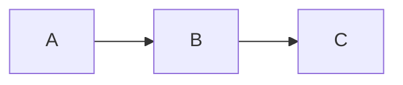

# Quick Checklist: Next Delegation Round (TradeBot)

Use this before starting any MCP delegation task. Estimated time: 2 minutes.

## Pre-Flight Check

- [ ] **Scope clear?** (what's in, what's out, file count, time limit)
- [ ] **Local work done?** (grep/index/scan completed, facts gathered)
- [ ] **Protocol drafted?** (root message written, rules documented)
- [ ] **Files ready?** (indexed, @attach# references prepared)
- [ ] **Model list chosen?** (who does what, max 3-4 models)
- [ ] **Output format defined?** (table, checklist, markdown, diagram)

If ANY box unchecked → **stop, prepare that first**.

---

## Execution Flow (5-Step)

### Step 1: Create Chat + Root Message (2 min)
```powershell
# Create chat (via MCP or UI)
# Copy-paste prepared root message (NO MODEL TAGS)
# Wait 3 seconds
# Do NOT proceed until status = "stable"
```

### Step 2: Echo Test (1 min)
```
@gpt5c @claude4o — 1 line each: confirm you read root message + understand boundaries?
```
- If OK → continue.
- If "need more context" → fix root message, re-post, retry.
- Backoff: max 2 retries, then switch to direct wiki instead.

### Step 3: Assign Sub-Tasks (1 min per task)
```
@gpt5c: [specific deliverable 1] — 5 min
@claude4o: [specific deliverable 2] — 5 min
@grok4f: [specific deliverable 3] — 5 min
```
- One line per model (keep it tight).
- Include time budget.
- NO follow-up comments (one message only).

### Step 4: Wait & Collect (varies)
- Set timer for longest time budget + 1 min.
- When done: `cq_get_history` → copy results.
- Close chat (archive link for memory).

### Step 5: Synthesize & Commit (varies)
- Merge results into **single artifact** (table, markdown, list).
- Validate against accepted findings (no dupes, no contradictions).
- Commit to repo or memory.

---

## Model Assignments (Quick Reference)

| Sub-Task | Primary | Secondary | Time |
|----------|---------|-----------|------|
| Find issues/bugs | `gpt5c` | `grok4f` (validation) | 5 min |
| Structure/checklists | `claude4s` | `gpt5c` (refinement) | 5 min |
| Creative content | `claude4s` | `gpt5c` (critique) | 10 min |
| Safety/Security | `claude4o` | `gpt5c` (confirmation) | 5 min |
| Patterns/grep | `grok4f` | `gpt5n` (speed check) | 3 min |
| Diagrams/Mermaid | `claude4o` | `gpt5c` (validation) | 5 min |

---

## Output Formats (Templates)

### Table (Findings)
```
| severity | file | issue | impact | fix |
|----------|------|-------|--------|-----|
| high | foo.php | missing check | crash on edge case | add validation |
```

### Checklist
```
- [ ] Step 1: description
- [ ] Step 2: description
- [ ] Step 3: description
```

### Markdown (Structure)
```
## Page Title
Purpose: [one line]
Sections:
- Intro
- Details
- Conclusion
```

### Mermaid (Diagrams)


---

## Abort Scenarios (When to Bail)

1. **Echo test fails twice** → chat context not loading, switch to direct wiki.
2. **No response after 10 min** → queue overload, move to different project.
3. **Model asks again for files** → root message too vague, rewrite + retry ONE.
4. **Task output contradicts prior** → models diverged, run cross-check subtask.
5. **Token meter shows runaway** → either context bloated or sync mode stuck, reset chat.

**Fallback action**: Split into smaller, serial tasks instead of parallel.

---

## Cost Watch (Abort if Exceeded)

- **1K tokens for finding check** (should be < 1min).
- **3K tokens for structure** (should be 5-10 min).
- **5K tokens for full wiki** (should be 15 min).
- **If burn rate 2x expected**: STOP, debug root message or model choice.

---

## Post-Execution (Always Do)

1. **Save to memory**: protocol used, model selections, time/cost actual.
2. **Document in wiki**: link findings to this checklist version.
3. **Commit results**: git add results, message notes delegation round number.
4. **Mark backlog task done**: update [SANITIZATION_BACKLOG.md](./SANITIZATION_BACKLOG.md) if applicable.

---

## Mistakes to Avoid (Lessons Paid For)

- ❌ "Add all models at once" → serialization hell.
- ❌ "Tag models before they read rules" → speculative answers.
- ❌ "Dump full project in @attach#" → context bloat, slow parsing.
- ❌ "Expect LLM to be grep" → use grep + grep, then ask LLM to judge.
- ❌ "Leave results scattered" → confusing, hard to consolidate.
- ❌ "Retry without changing approach" → throws good money after bad.

---

## Next Review Cycle (Recommended)

**Date**: April 4, 2026 (one week).  
**Goal**: Apply v2 protocol on actual TradeBot sanitization (P0 files).  
**Expected outcome**: <10 min, <3K tokens, clear approval/rejection per finding.  
**Metric**: compare time/cost vs. March 28 pilot.

